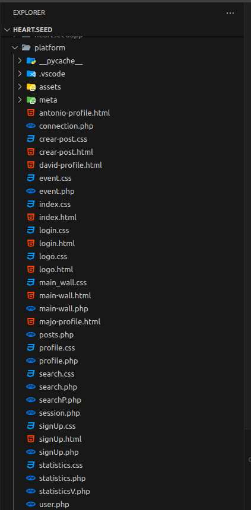
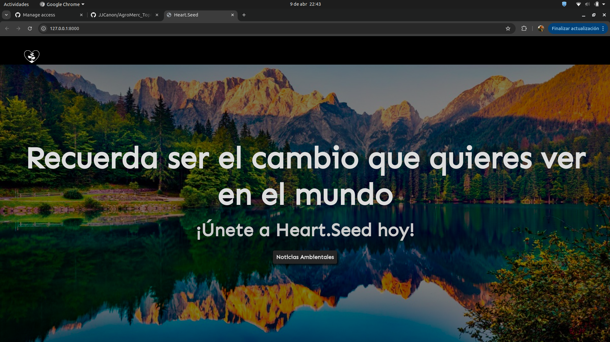
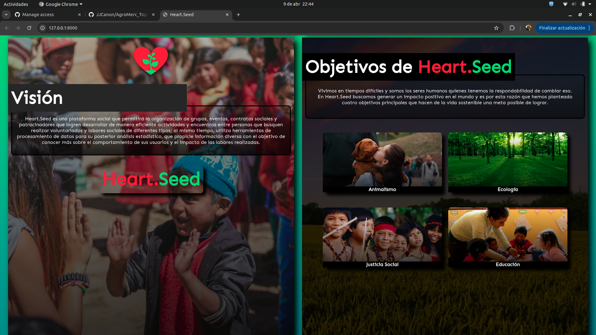
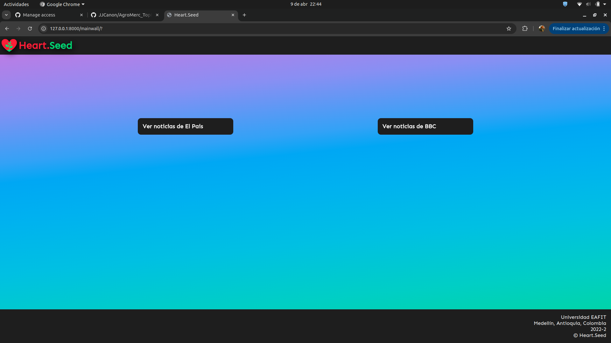
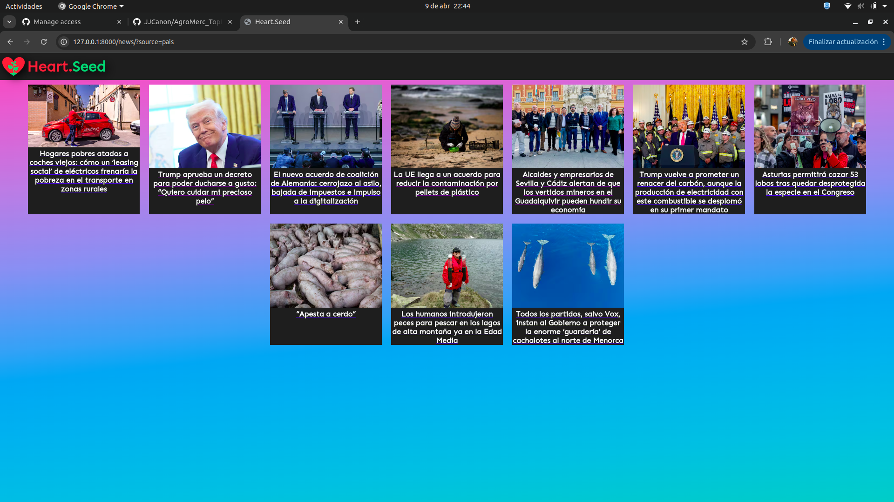
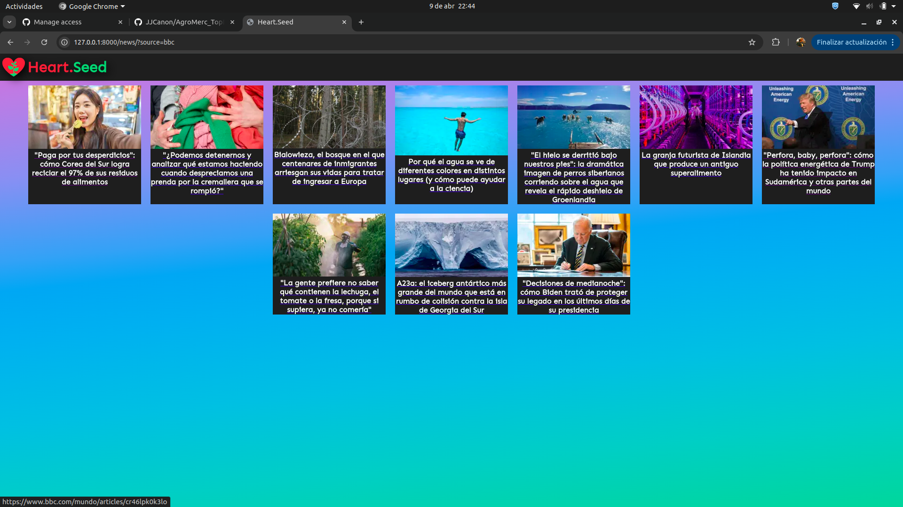

# Taller 1 - TEIS

### Integrantes:
* Antonio Carbonó Pedroza
* Juan José Cañón
* Simón Botero

## Sustentación de actividades

### Justificación
Durante el desarrollo del taller, nuestro equipo se enfrentó a una serie de dificultades derivadas del estado inicial del proyecto disponible. La aplicación presentaba un diseño deficiente, múltiples malas prácticas y una arquitectura inconsistente, destacando el uso simultáneo de PHP y Python, lo que hacía inviable su reutilización directa.
Ante esta situación, decidimos migrar únicamente algunas funcionalidades y vistas muy básicas al framework Django. A partir de ahí, enfocamos el desarrollo del taller en una nueva funcionalidad de web scraping, donde pudimos aplicar de forma más controlada y estructurada los conceptos propuestos, garantizando buenas prácticas y una arquitectura sostenible.

### Desarrollo de nueva funcionalidad: Web Scraping
Como parte central del taller, desarrollamos una funcionalidad de web scraping que permite obtener titulares de noticias desde diferentes portales informativos. Esta fue la base sobre la cual aplicamos los principios de arquitectura limpia, patrones de diseño y buenas prácticas de desarrollo con Django.

### Actividad 2
#### Usabilidad:
* Flujo de usuario claro (login, muro, perfiles).
* Estilos organizados por componente.
* Falta validación de formularios y mensajes de error.

#### Compatibilidad:
* HTML/CSS básico funciona en navegadores modernos.
* Sin diseño responsive.
* Uso mixto de PHP y Python genera problemas de sostenibilidad (se migrará a Django).

#### Rendimiento:
* Archivos CSS externos bien separados.
* Sin paginación ni lazy loading.
* Consultas múltiples en PHP sin control.

#### Seguridad
* Vulnerable a SQL Injection (connection.php).
* Formularios sin protección CSRF/XSS.
* Sistema de login inseguro (PHP sin cifrado).

#### Evidencia de estructura del proyecto anterior

### Actividad 3: Inversión de dependencias
En la funcionalidad de web scraping aplicamos el principio de inversión de dependencias al desacoplar la lógica de obtención de noticias de su uso en las vistas. Para lograrlo, definimos una interfaz `NewsScraper` que representa el comportamiento común de todos los scrapers, y las clases concretas como `BBCScraper` o `PaisScraper` implementan esa interfaz. De esta manera, las vistas trabajan sobre la abstracción y no sobre implementaciones específicas, permitiendo mayor flexibilidad, escalabilidad y facilidad de pruebas.

### Actividad 4: Patrón de diseño de Python
Se implementó el patrón Factory Method para encapsular la creación de scrapers según la fuente de noticias seleccionada. A través de la clase `ScraperProvider`, el sistema decide dinámicamente qué clase concreta instanciar (como `BBCScraper` o `PaisScraper`) sin que la vista conozca esos detalles. Esto mejora la escalabilidad del proyecto y mantiene el código desacoplado y organizado.

### Actividad 5: Patrón de diseño de Django
Se aplicó el patrón CBV al usar `TemplateView` para renderizar las páginas principales del proyecto. Esto permitió escribir vistas más limpias, reutilizables y alineadas con la arquitectura de Django, aprovechando su comportamiento por defecto sin necesidad de duplicar lógica o escribir funciones adicionales.

### Bono
#### Funcionalidad Nueva: Web Scraping
Dado que el proyecto base presentaba una arquitectura muy deficiente y una mezcla poco mantenible de tecnologías (PHP y Python), migrar sus funcionalidades principales a Django resultaba complejo y poco eficiente. Por esta razón, se decidió desarrollar desde cero una nueva funcionalidad de web scraping, la cual permitió aplicar correctamente los principios y patrones exigidos en el taller dentro de un entorno controlado, limpio y alineado con las buenas prácticas del framework.

### Funcionalidades corriendo
#### Página principal

#### Selección de fuente

#### Noticias extraídas de El País

#### Noticias extraídas de BBC

